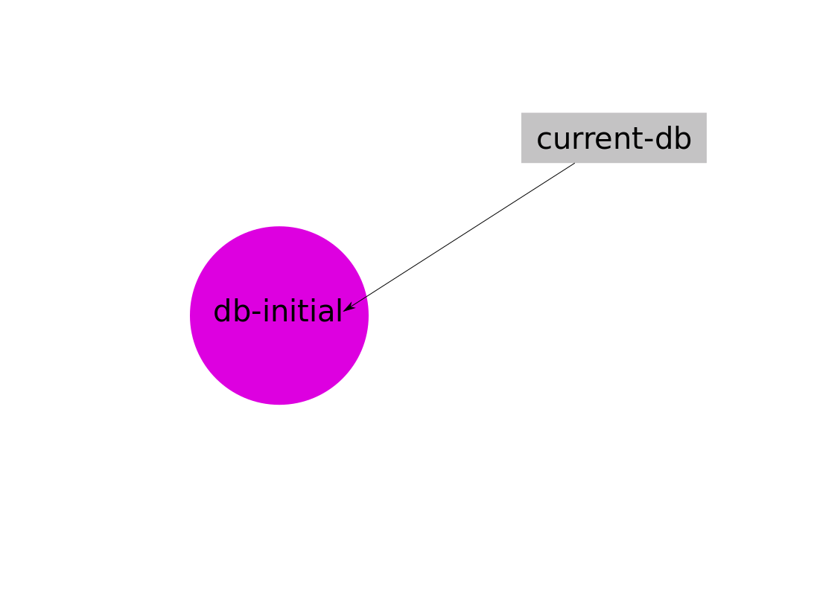
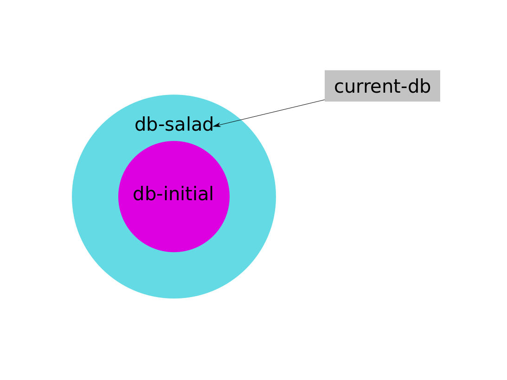
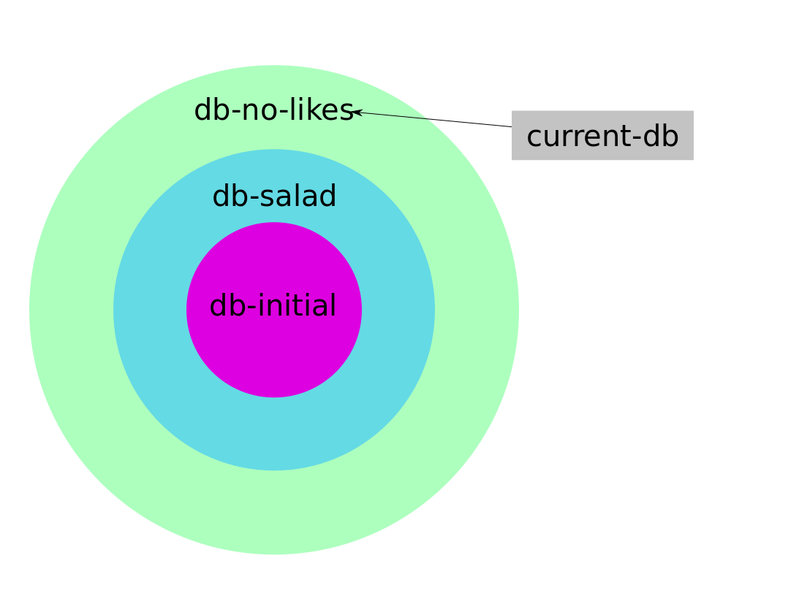
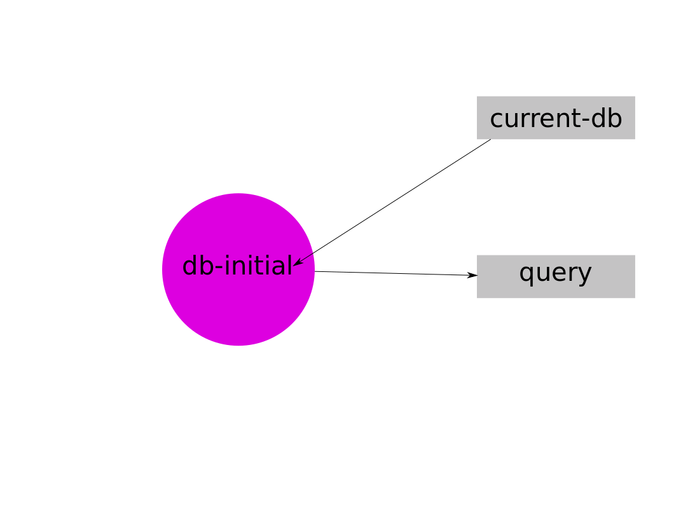
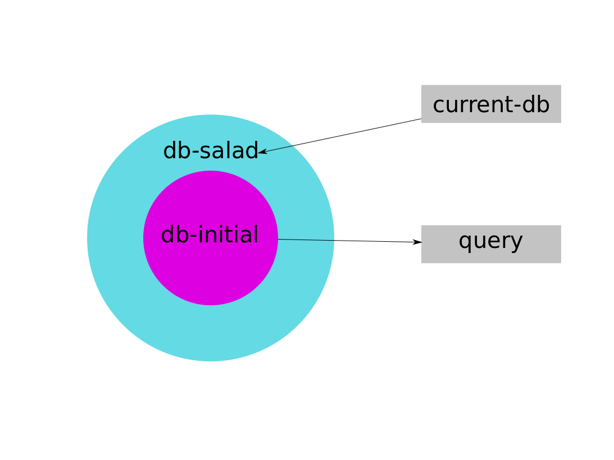
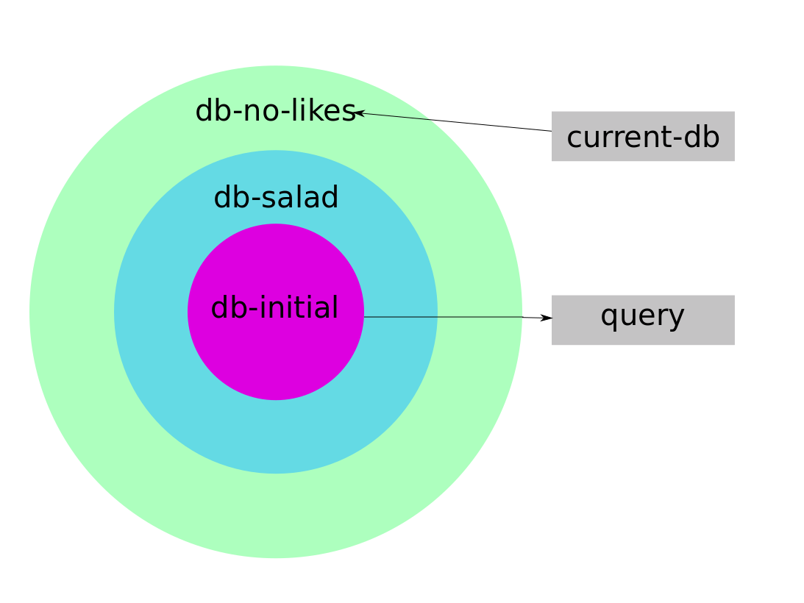

Datomic always grows

!SLIDE

No data is ever removed from Datomic, it only accumulates data, never updating or erasing it

!SLIDE

Does this mean we can never erase or update anything?

!SLIDE

A new database is created for each transaction

    @@@clojure
    ;; Creates db-initial
    (d/transact connection
      [{:person/name "Alice"
        :person/likes "pizza"}])

 

	@@@clojure
    ;; Gets ("Alice" "pizza")
	(d/q '[:find ?name ?likes
		   :where [?person :person/name ?name]
				  [?person :person/likes ?likes]]
		 db-initial)

!SLIDE

Changing a attribute value creates a new database

    @@@clojure
    ;; Creates db-salad
    (d/transact connection
      [{:db/id alice-id
        :person/likes "salad"}])

 

	@@@clojure
    ;; Gets ("Alice" "salad")
	(d/q '[:find ?name ?likes
		   :where [?person :person/name ?name]
				  [?person :person/likes ?likes]]
		 db-salad)

!SLIDE

Removing an attribute value creates a new database

    @@@clojure
    ;; Creates db-no-likes
    (d/transact connection
      [:db/retract alice-id :person/likes "salad"])

 

	@@@clojure
    ;; Gets ()
	(d/q '[:find ?name ?likes
		   :where [?person :person/name ?name]
				  [?person :person/likes ?likes]]
		 db-no-likes)

!SLIDE

# Starting Database

!SLIDE

# Salad Database

!SLIDE

# No Likes Database

!SLIDE

# Writes don't block queries

!SLIDE

# Query Starting Database

!SLIDE

# Salad Database

!SLIDE

# No Likes Database

